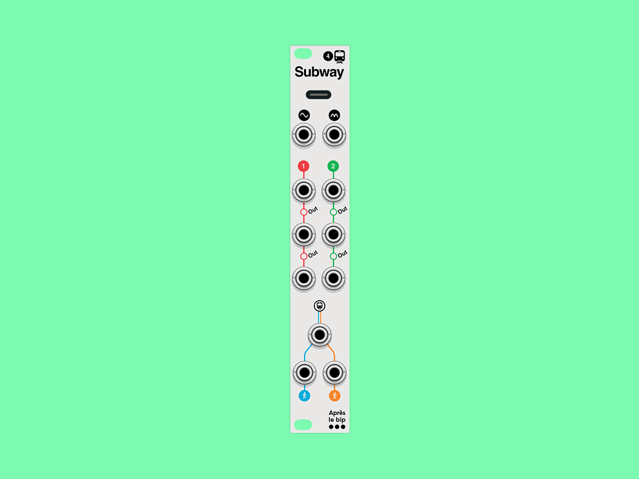

# Ⓜ️ Subway 4

**Passive Utility Collection for VCV Rack 2 · 4HP**

Hop in, hop out, change line, cross the platform to get in a new carriage. This is Subway 4, a utility collection cleverly normalized letting you choose the path you need for your signal, at any time.

It also runs on real rails: meet the **[hardware module](https://www.apreslebipmodular.com/produit/subway-4)**.

---

## ⬇️ Download & install

1. From the **[latest release](https://github.com/apreslebip/Subway4/releases/latest)**, download the `.vcvplugin` for your platform:
   - macOS Apple Silicon → `…-mac-arm64.vcvplugin`
   - macOS Intel → `…-mac-x64.vcvplugin`
   - Windows → `…-win-x64.vcvplugin`
   - Linux → `…-lin-x64.vcvplugin`
2. In VCV Rack 2, open **Help → Open user folder**. A `Rack2` folder opens.
3. Move the downloaded file into the subfolder matching your platform: `plugins-mac-arm64`, `plugins-mac-x64`, `plugins-win-x64` or `plugins-lin-x64` (delete any older Subway 4 there first).
4. Restart Rack. It extracts and loads the plugin on launch, and Subway 4 appears under the **Après le bip** brand.

Free to use. Full **[manual](https://www.apreslebipmodular.com/produit/subway-4)**.

---

## ⚡ Rectify

The first two jacks are a **precision full-wave rectifier**: whatever goes in comes out positive. Send a bipolar LFO and you get a unipolar one at twice the speed. Send audio and you get that hollow octave-up timbre.

Precision matters here. The diodes sit inside the feedback loop, so there is no 0.6V dead zone around zero: a signal that barely moves rectifies as cleanly as one that swings full range. Nothing gets swallowed.

---

## 〰️ Two lines, one network

Below the rectifier run **Line 1** and **Line 2**, two passive 1→2 multiples. What makes them interesting is not the copying, it is how they are wired to each other:

**RECT OUT → LINE 1 IN → LINE 2 IN.** Each input is normalled to the one upstream of it, so every jack you leave empty passes the signal further down the network, and every jack you patch takes over from there. One module, three different behaviours, decided entirely by where you plug in:

| What you patch | What you get |
|---|---|
| Only the rectifier input | The rectified signal on all four outputs, a 1→4 mult |
| Line 1 in | Four copies of your own source, while the rectifier keeps working on its own |
| Line 1 in **and** Line 2 in | Two fully independent 1→2 mults |

Passive means copper, not circuitry. No buffer, no gain stage, no coloration. What arrives is what leaves.

---

## 🎛️ Mix

Two passengers, one carriage. **MIX A** and **MIX B** meet at a resistive node and come out averaged: `OUT = (A + B) / 2`.

Sum two CVs without them piling past 10V. Blend two LFOs into a shape neither one makes alone. Feed the same offset into both inputs and you get that offset back, not double it.

**Patch a single input and you get half amplitude.** That is not a shortcoming, it is what averaging with silence means. The hardware does exactly this, so the plugin does too.

---

## 🔌 Inputs / Outputs

| Jack | Description |
|------|-------------|
| **RECT IN** | Signal to rectify (bipolar in, unipolar out) |
| **RECT OUT** | The rectified signal. Normalled to Line 1 in |
| **LINE 1 IN** | Line 1 source. Normalled from Rect out, and on to Line 2 in |
| **LINE 1 OUT A / B** | Two copies of line 1 |
| **LINE 2 IN** | Line 2 source. Normalled from Line 1 in |
| **LINE 2 OUT A / B** | Two copies of line 2 |
| **MIX A / MIX B** | The two signals to average |
| **MIX OUT** | `(A + B) / 2` |

---

## 📖 Manual

Full documentation, patching ideas and the hardware version → **[apreslebipmodular.com](https://www.apreslebipmodular.com/produit/subway-4)**

---

## 📄 License

Subway 4 is **freeware**, free to download and use, not open source. © 2026 Après le bip. See [LICENSE](LICENSE).
